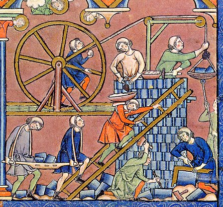

  

<h1 align="center">Freemason Build System</h1>

### What is Freemason?
**Freemason** is a declarative build system, that is capable of minimalistic and consistent definition of build methods of a system that is composed of a large set of source code modules and to execute build operations on various platforms in a distributed manner.

The focus of **Freemason** is on C/C++ projects. It can, however, be easily adapted to any toolchain with a traditional compiler/linker/archiver combination.

It is based on a variants of **GNU make** along with **distcc**.

**Freemason** was conceived before the emergence of Git and Docker, thus it relies on cross-compilers running on workstations and build servers.
It also assumes source code to be present on shared volumes which are consistent across build hosts.

### Documentation
* [Introduction](https://formalism-labs.github.io/freemason.docs/intro/introduction-to-freemason.pdf)
* [User guide](https://formalism-labs.github.io/freemason.docs/user-guide/freemason-user-guide.pdf)
* [Technical review](https://formalism-labs.github.io/freemason.docs/design/freemason-tech-review.pdf)

### Components
* [GNU make](docs/gnu-make.md)
* Perl 5
* [Distcc](docs/distcc.md)
* [Documentation repo](https://github.com/formalism-labs/freemason.docs)
