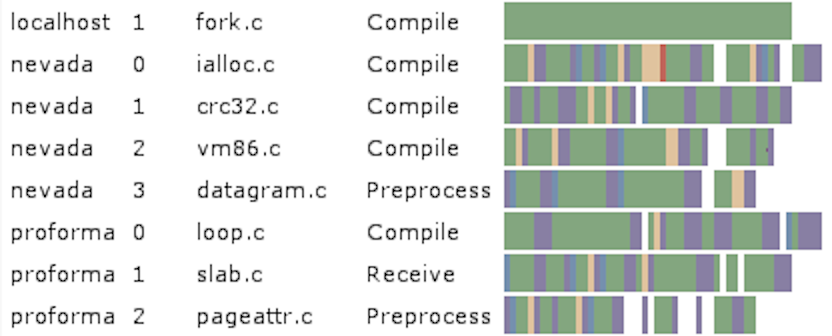

  

<h1 align="center">Distcc</h1>
<h2 align="center">with Freemason variations</h2>

### How distcc is used in Freemason

### Repository information
* Base distcc version: `2.18.3` (just before the introduction of the "pump" functionality)
* Repository: [freemason.distcc)](https://github.com/formalism-labs/distcc)

### Freemason variations
TBD

### Future developments
* Empyoing ZeroMQ as a distributed messaging mechanism instead of the distcc-traditional one.
* CCache integration.
* Support for more compilers (Clang, TI)