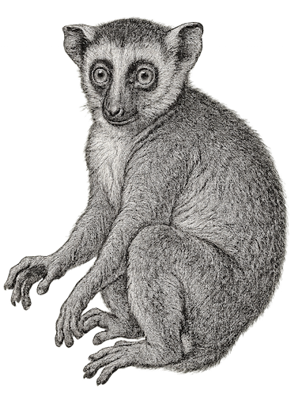

  

<h1 align="center">GNU Make</h1>
<h2 align="center">with Freemason variations</h2>

### Why GNU make?

### Repository information
* Base GNU make version: `4.2.90`
* Repository: [GNU make (branch `f7n-1`)](https://bitbucket.org/raffapen/freemason.make/src/f7n-1/)

### Freemason variations

As Freemason relies heavily on dynamically including large number of makefiles, it requires a preprocessing option similar to the one offered by the C preprocessor, to allow diagnosis of the fully expanded makefile "build-unit". Thus the `-P` option was added. This proves to be very effective even in non-Freemason projects - note that the modified make utility is backward compatible with the original one.

Generally speaking, the variations are articulated as features, each of which has a `FEATURE_*` macro which controls its presence in the code.

Features are controlled from the [`makeint.h`](https://bitbucket.org/raffapen/freemason.make/src/f7n-1/makeint.h) header file, and can be disabled by remarking the feature macro out.

### Future developments

* Presentation as features as patch files, so they can be easily applied on upstream versions,
* Support for "Make Modules": encapsulation of definitions into a syntactic scope.
